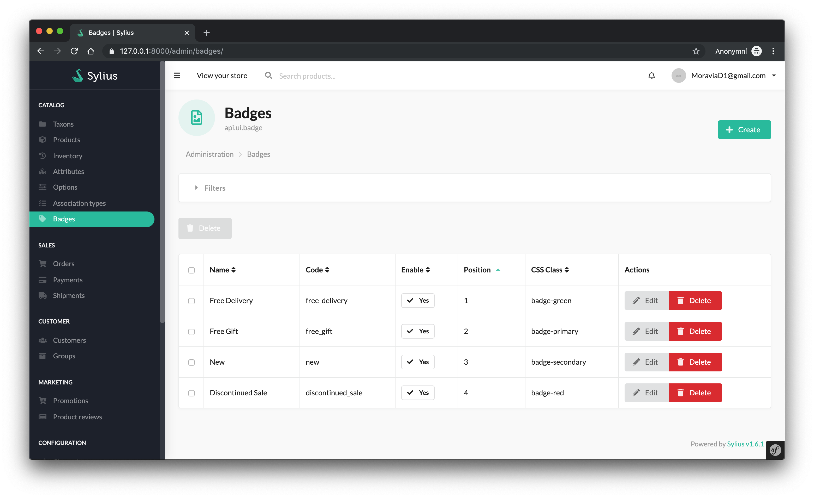
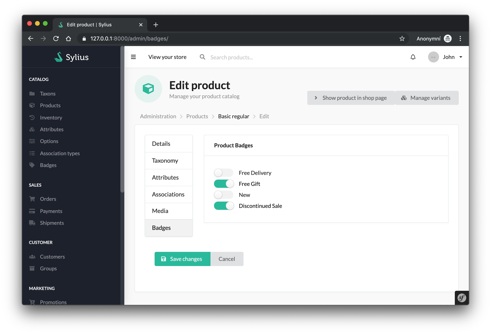

<p align="center">
    <a href="https://sylius.com" target="_blank">
        
    </a>
</p>

<h1 align="center">Sylius Badge Plugin</h1>

Add extra badges to product entity.

## Content

- [Installation](#installation)
- [Usage](#usage)
- [Limitations](#limitations) :warning:
- [Development](#development)
- [Implemented functionality](#implemented-functionality)
- [Contributing](#contributing)

### Installation

The best way to install bundle is using Composer:
```bash
$ composer require oxyshop/sylius-badge-plugin
```

<!--
And you're done.

Other manual changes are done automatically via [Flex](https://symfony.com/doc/current/setup/flex.html). In case you don't use a Flex, you have to do following steps:
--> 

Register plugin `bundles.php`
```php
// bundles.php

return [
    ...
    Oxyshop\SyliusBadgePlugin\OxyshopSyliusBadgePlugin::class => ['all' => true],
]
```

*  Your entity `Product` has to implement `BadgableInterface`. You can use **trait** `BadgeableTrait` to achieve that.
*  Import routing plugin configuration from `Resource/config/default`
*  Update your schema via database migration

For guide to use your own entity see [Sylius docs - Customizing Models](https://docs.sylius.com/en/latest/customization/model.html)

### Usage

You can manage badges in shop administration:


Add them to the product in "Badges" tab:


### Limitations

- `BadgeChoiceType` use `Doctrine\ORM\EntityRepository::findAll()` method to get all badges
- Installation of this plugin is a little bit tricky according [best practices](https://github.com/Sylius/Sylius/issues/9214)

### Development

- Using `test` environment:

    ```bash
    $ (cd tests/Application && bin/console sylius:fixtures:load -e test)
    $ (cd tests/Application && bin/console server:run -d public -e test)
    ```

- Using `dev` environment:

    ```bash
    $ (cd tests/Application && bin/console sylius:fixtures:load -e dev)
    $ (cd tests/Application && bin/console server:run -d public -e dev)
    ```

### Implemented functionality

- [x] Badge CRUD
- [x] Edit associations between the product and the labels
- [ ] Edit associations between the label and the products
- [ ] Use `BadgeAutocomplteChoiceType` instead of `BadgeChoiceType`
- [ ] Flex receipt
- [ ] Behat and PHPSpecs tests

### Contributing

Feel free to create new issue or even better - send your PR.
